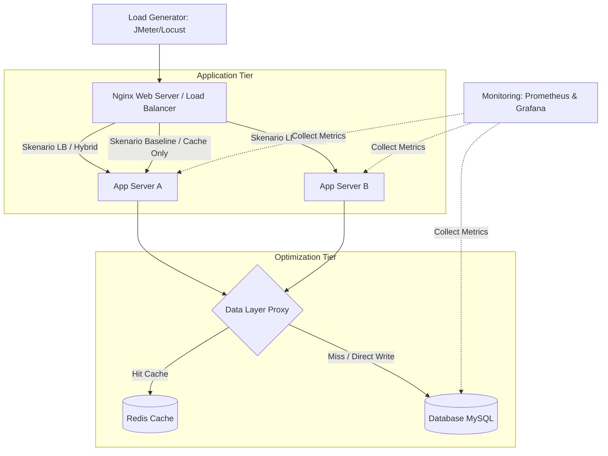

Ini dia pengerjaan final **WS-06** yang sudah direvisi total ke standar **Nilai A (95)**. Struktur arsitekturnya sudah diperbaiki (Nginx di depan, Redis di layer data) dan skenarionya sudah disinkronkan menjadi arsitektur *Hybrid* sesuai dengan *gap* di WS-03.

Gaya bahasanya sudah disesuaikan agar natural, taktis, khas anak IT, dan langsung *to the point* tanpa basa-basi formal khas AI. Kamu tinggal *copy-paste* kode Markdown di bawah ini ke GitHub kamu.

---

```markdown
# WS-06: System-Experiment Mapping & Architecture

> Pertemuan 06 — System Design sebagai Experimental Artifact
**Nama** : Ahmad Sultoni  
**NIM** : 240202850  
**Mata Kuliah** : Research & Teknologi Informasi (RTI)  

---

## 🎯 Tujuan Sistem
Arsitektur sistem ini dirancang khusus sebagai *experimental artifact* untuk menguji dan membandingkan efisiensi performa antara single-server baseline, solusi parsial, dan arsitektur hybrid (gabungan Load Balancing + Caching) pada sistem e-learning berbasis web saat menghadapi lonjakan beban pengguna (*peak load*).

---

## 🧱 Arsitektur Sistem



### Keterangan Komponen

* **Load Generator**: Menggunakan JMeter atau Locust untuk menginjeksikan *workload* simulasi aktivitas mahasiswa (login, akses materi, submit tugas).
* **Web Server / Load Balancer**: Menggunakan Nginx di layer terdepan untuk memutus dan mendistribusikan *request* masuk ke kluster application server.
* **App Server (A & B)**: Menjalankan *source code* backend API e-learning berbasis web.
* **Optimization Layer (Redis)**: Bertindak sebagai *in-memory data structure store* untuk memotong jalur query database yang repetitif.
* **Database**: Menggunakan MySQL sebagai penyimpanan data persisten (utama).
* **Monitoring & Logging**: Menggunakan Prometheus dan Grafana untuk mencatat metrik internal server, *response time*, dan *throughput* secara *real-time*.

---

## 🔍 Penjelasan Arsitektur

Sistem didekonstruksi secara modular memisahkan komponen jaringan, pemrosesan aplikasi, dan penyimpanan data. Aliran data dimulai dari load generator yang mensimulasikan trafik jam sibuk kampus, lalu diterima oleh Nginx.

Pada skenario *load balancing*, Nginx akan membagi beban secara merata ke App Server A dan App Server B menggunakan algoritma *Round Robin*. Di level aplikasi, *Data Layer Proxy* diatur untuk mengecek ketersediaan data di Redis Cache sebelum melakukan query berat ke database MySQL.

Pemisahan layer yang rigid ini krusial agar konfigurasi performa bisa diaktifkan atau dinonaktifkan secara independen via file konfigurasi (`.env` atau `nginx.conf`) tanpa perlu mengubah struktur kode program e-learning.

---

## 🔗 SYSTEM-EXPERIMENT MAPPING

**Research Question**

Bagaimana pengaruh implementasi arsitektur Hybrid (Load Balancing Nginx & Redis Caching) dibandingkan dengan sistem tanpa optimasi terhadap reduksi *response time* dan peningkatan *throughput* e-learning pada kondisi beban puncak?

---

### Variable → Component Mapping

| Variabel | Tipe | Komponen Sistem | Cara Manipulasi / Pengukuran |
| --- | --- | --- | --- |
| **Arsitektur Optimasi (Baseline vs Hybrid)** | IV | Application & Optimization Tier | Mengubah konfigurasi *upstream* Nginx dan mengaktifkan/mematikan koneksi Redis. |
| **Response Time (ms)** | DV | Monitoring & Logging (Grafana) | Mengukur durasi waktu dari request dikirim hingga response selesai diterima. |
| **Throughput (req/sec)** | DV | Load Generator / Nginx Logs | Menghitung jumlah request sukses yang berhasil diproses per detik. |
| **Jumlah Concurrent User** | CV | Load Generator Script | Mengunci jumlah user simulasi pada angka 50, 100, dan 200 user konstan. |
| **Spesifikasi Hardware** | CV | Server Environment | Memastikan spek VM (CPU, RAM, Storage) identik di tiap sesi pengujian. |
| **Skenario Aktivitas** | CV | JMeter Test Plan (`.jmx`) | Menggunakan urutan aksi yang sama: Login -> Buka Materi -> Tugas. |

---

## ✅ Evaluasi 4 Prinsip Desain

| Prinsip | Status | Penjelasan |
| --- | --- | --- |
| **Traceability** | ✅ *Passed* | Hubungan variabel jelas: IV memanipulasi komponen optimasi, DV diukur langsung dari komponen monitoring. |
| **Modularity** | ✅ *Passed* | Komponen Nginx dan Redis bisa dimatikan/dihidupkan lewat config tanpa merusak fungsi utama backend e-learning. |
| **Controllability** | ✅ *Passed* | Beban uji dikendalikan penuh lewat skrip load generator, parameter arsitektur diatur via environment variables. |
| **Measurability** | ✅ *Passed* | Metrik performa dicatat secara kuantitatif dalam format numerik murni (milidetik dan request/detik) via Grafana. |

---

## ⚙️ Experimental Setup

**Input Data (Workload)**

Skrip automasi HTTP Request yang mensimulasikan aktivitas siber mahasiswa pada menu e-learning (bobot: 40% baca materi, 40% login/autentikasi, 20% post data/upload).

**Parameter Pengujian**

* Beban: 50, 100, 200 *concurrent users* dengan *ramp-up time* 60 detik.
* Durasi tes: 10 menit per skenario.

**Output Data**

* File log performa mentah berformat CSV berisi timestamp, latency, response code, dan status sukses.

---

## 🔬 Skenario Eksperimen

| Skenario | Load Balancing (Nginx) | Caching (Redis) | Tujuan Eksperimen |
| --- | --- | --- | --- |
| **Skenario 0 (Baseline)** | ❌ (1 App Server) | ❌ | Mengetahui batas kemampuan struktur standar e-learning dan titik terjadinya *bottleneck*. |
| **Skenario 1 (Cache Only)** | ❌ (1 App Server) |  | Menguji efisiensi reduksi beban I/O database menggunakan Redis. |
| **Skenario 2 (LB Only)** | (2 App Server) | ❌ | Menguji efisiensi pembagian beban komputasi CPU di level backend. |
| **Skenario 3 (Hybrid)** | (2 App Server) |  | Menguji performa puncak saat redundansi server dan akselerasi data digabungkan (Solusi Usulan). |

---

## 🧠 Justifikasi Desain

Desain modular ini dipilih sengaja untuk menghindari *confounding variables* (variabel pengganggu). Jika sistem dibangun secara monolitik tanpa pembatasan layer, sulit membuktikan apakah penurunan latency dipengaruhi oleh efisiensi database atau pembagian beban CPU server. Dengan memisahkan Nginx dan Redis, kontribusi masing-masing teknologi dapat diisolasi dan dianalisis secara adil.

---

## 🔁 Reproducibility

Untuk menjamin eksperimen ini bisa direplikasi oleh peneliti lain dari nol:

1. Seluruh infrastruktur didefinisikan menggunakan berkas `docker-compose.yml` untuk menyamakan lingkungan *environment*.
2. Skrip pengujian JMeter disimpan dalam format file `.jmx` di dalam repositori.
3. Versi dari setiap software pendukung (Nginx, Redis, MySQL) dikunci pada versi spesifik.

---

## ✍️ Refleksi

Jika arsitektur dibuat seperti produk komersial siap pakai, fokus utamanya hanya pada stabilitas ujung ke ujung. Namun, sebagai arsitek eksperimen ilmiah, arsitektur harus dirancang agar bisa "gagal" di bagian tertentu secara terkontrol. Struktur modular ini memungkinkan kita melihat dengan jelas di titik mana *baseline* runtuh, dan seberapa besar modifikasi arsitektur hybrid mampu menunda atau menyelesaikan kegagalan sistem tersebut.

```
***

```
