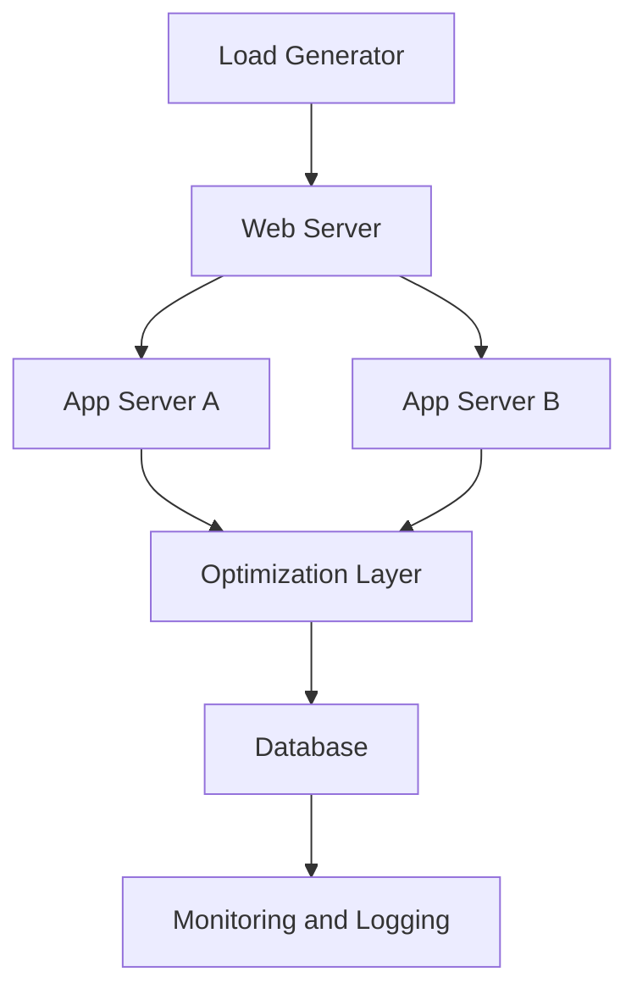

---

# WS-06: System-Experiment Mapping & Architecture

> Bab 6 — System Design sebagai Experimental Artifact

**Nama** : Ahmad Sultoni
**NIM** : 240202850
**Mata Kuliah** : Research & Teknologi Informasi (RTI)

---

## 🎯 Tujuan Sistem

Arsitektur sistem ini dirancang sebagai *experimental artifact* untuk menguji perbandingan performa antara metode caching dan load balancing pada sistem e-learning berbasis web dalam kondisi beban pengguna tinggi.

---

## 🧱 Arsitektur Sistem

### Keterangan Komponen

- Load Generator menggunakan JMeter atau Locust untuk simulasi pengguna  
- Web Server menggunakan Nginx  
- App Server menjalankan backend API sistem e-learning  
- Database menggunakan MySQL  
- Monitoring and Logging digunakan untuk mencatat response time dan throughput  

## 🔍 Penjelasan Arsitektur

Arsitektur sistem dirancang secara modular untuk memastikan setiap komponen memiliki peran yang jelas dalam eksperimen. Load generator digunakan untuk mensimulasikan banyak pengguna secara bersamaan sehingga sistem dapat diuji dalam kondisi beban tinggi.

Web server berfungsi menerima request dan meneruskannya ke application server yang menjalankan logika utama sistem e-learning, seperti autentikasi dan akses materi. Pada bagian ini digunakan lebih dari satu application server untuk mendukung skenario load balancing.

Fokus utama penelitian berada pada bagian optimization layer, di mana metode caching dan load balancing diuji secara terpisah. Monitoring dan logging digunakan untuk mencatat response time dan throughput secara otomatis sebagai dasar analisis performa.

Pendekatan ini memastikan bahwa setiap perubahan hanya terjadi pada variabel yang diuji, sehingga hasil eksperimen tetap valid dan dapat direproduksi.

---

## 🔗 SYSTEM-EXPERIMENT MAPPING

**Research Question**
Apakah metode caching menghasilkan response time yang lebih rendah dibandingkan load balancing pada sistem e-learning berbasis web dengan jumlah pengguna tinggi?

---

### Variable → Component Mapping

| Variabel                                    | Tipe | Komponen Sistem      | Cara Manipulasi / Pengukuran            |
| ------------------------------------------- | ---- | -------------------- | --------------------------------------- |
| Metode optimasi (caching vs load balancing) | IV   | Optimization Layer   | Mengaktifkan metode melalui konfigurasi |
| Response time                               | DV   | Monitoring & Logging | Mengukur waktu respon                   |
| Throughput                                  | DV   | Monitoring & Logging | Menghitung request per detik            |
| Jumlah user                                 | CV   | Load Generator       | Menentukan jumlah user                  |
| Spesifikasi server                          | CV   | Server Configuration | Dijaga tetap sama                       |
| Skenario request                            | CV   | Load Script          | Menggunakan skenario yang sama          |

---

## ✅ Evaluasi 4 Prinsip Desain

| Prinsip         | Status | Penjelasan                                     |
| --------------- | ------ | ---------------------------------------------- |
| Traceability    | ✅      | Variabel terhubung dengan komponen sistem      |
| Modularity      | ✅      | Metode bisa diganti tanpa mengubah sistem lain |
| Controllability | ✅      | Parameter diatur melalui konfigurasi           |
| Measurability   | ✅      | Sistem mencatat metrik otomatis                |

---

## ⚙️ Experimental Setup

**Input Data**
Simulasi aktivitas pengguna (login, akses materi, tugas)

**Parameter**

* Jumlah user: 50, 100, 200
* Metode: caching / load balancing

**Output**

* Response time (ms)
* Throughput (request/second)
* Format CSV

---

## 🔬 Skenario Eksperimen

| Skenario   | Caching | Load Balancing | Tujuan             |
| ---------- | ------- | -------------- | ------------------ |
| Baseline   | ❌       | ❌              | Performa awal      |
| Skenario 1 | ✅       | ❌              | Uji caching        |
| Skenario 2 | ❌       | ✅              | Uji load balancing |

Setiap skenario dijalankan dengan parameter yang sama untuk memastikan perbandingan yang adil.

---

## 🧠 Justifikasi Desain

Desain sistem dibuat modular agar setiap variabel dapat diuji secara terpisah. Hal ini penting untuk memastikan bahwa hasil eksperimen benar-benar dipengaruhi oleh metode optimasi yang digunakan.

---

## 🔁 Reproducibility

* Parameter diatur melalui konfigurasi
* Skenario pengujian konsisten
* Output disimpan terstruktur
* Lingkungan sistem tetap

---

## ✍️ Refleksi

Jika sistem dibuat seperti produk (monolitik), maka sulit memisahkan pengaruh tiap variabel. Hal ini dapat menyebabkan hasil eksperimen tidak valid.

Dengan arsitektur modular, setiap komponen dapat diuji secara independen sehingga hasil penelitian lebih akurat dan dapat dipertanggungjawabkan.

---

